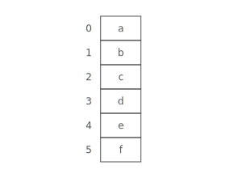

# Array

## Summary :book:
An array organizes items sequentially, one after another in memory.
> Each position in the array has an **index**, starting at 0.

## Strengths :white_check_mark:
- Fast lookups
> Retrieving the element at a given index takes O(1) time, regardless of the length of the array.
- Fast appends
> Adding a new element at the end of the array takes O(1) time, if the array has space.

## Weaknesses :x:
- Fixed size
> You need to specify how many elements you're going to store in your array ahead of time. (Use a [Dynamic Array](https://github.com/NicholsTyler/Game-Programming/Data_Structures/Dynamic_Array) if this is an issue)
- Costly inserts and deletes
> You have to "scoot over" the other elements to fill in or close gaps, which takes worst-case O(n) time. 

## Time Complexity :hourglass:
| Operation  | Worst Case |
| ---------- | ---------- |
| space      |    O(n)    |
| lookup     |    O(1)    |
| append     |    O(1)    |
| insert     |    O(n)    |
| delete     |    O(n)    |

## Inserting
If we want to insert something into an array, first we have to make space by "scooting over" everything starting at the index we're inserting into:

In the worst case we're inserting into the 0th index in the array (prepending), so we have to "scoot over" everything in the array. That's O(n) time. 

## Deleting
Array elements are stored adjacent to each other. So when we remove an element, we have to fill in the gap—"scooting over" all the elements that were after it: 

In the worst case we're deleting the 0th item in the array, so we have to "scoot over" everything else in the array. That's O(n) time. 
