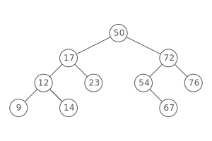
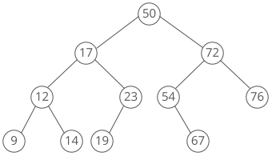
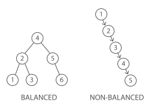

# Binary Search Tree

## Summary :book:
A binary search tree is a binary tree where the nodes are ordered in a specific way. For every node: 
> The nodes to the left are smaller than the current node.

> The nodes to the right are larger than the current node.

Checking if a binary tree is a binary search tree is a favorite question from interviews. 

## Uses :scroll:
- Count smaller elements on right, smallest greater element on right side
- Doubly ended priority queue

## Strengths :white_check_mark:
- Good performance across the board
>  Assuming they're balanced, binary search trees are good at lots of operations, even if they're not constant time for anything. 

> Compared to a sorted array, lookups take the same amount of time (O(lg(n)), but inserts and deletes are faster (O(lg(n)) for BSTs, O(n) for arrays). 

> Compared to dictionaries, BSTs have better worst case performance—O(lg(n)) instead of O(n). But, on average dictionaries perform better than BSTs (meaning O(1) time complexity). 

- BSTs are sorted
> Taking a binary search tree and pulling out all of the elements in sorted order can be done in O(n) using an in-order traversal. Finding the element closest to a value can be done in O(lg(n)) (again, if the BST is balanced!). 

## Weaknesses :x:
- Poor performance if unbalanced
> Some types of binary search trees balance automatically, but not all. If a BST is not balanced, then operations become O(n). 
- No O(1) operations
> BSTs aren't the fastest for anything. On average, a list or a dictionary will be faster

## Time Complexity :hourglass:
| Operation  |  Balanced  |  Unbalanced (Worst Case)  |
| ---------- | ---------- | ------------------------- |
| space      |   O(n)     |           O(n)            |
| insert     |   O(lg(n)) |           O(n)            |
| lookup     |   O(lg(n)) |           O(n)            |
| delete     |   O(lg(n)) |           O(n)            |

## Balanced Binary Search Tree
Two binary search trees can store the same values in different ways: 

Some trees (like AVL trees or Red-Black trees) rearrange nodes as they're inserted to ensure the tree is always balanced. 
> With these, the worst case complexity for searching, inserting, or deleting is always O(lg(n)), not O(n). 
