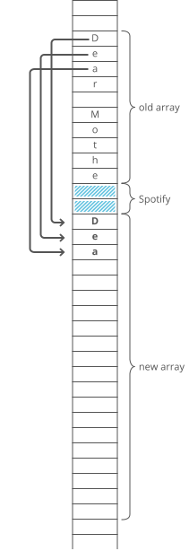

# Dynamic Array

## Summary :book:
A dynamic array is an array with a big improvement: automatic resizing. 
> A dynamic array expands as you add more elements. So you don't need to determine the size ahead of time. 

## Uses :scroll:
- When an array with variable size is needed

## Strengths :white_check_mark:
- Fast lookups
> Just like arrays, retrieving the element at a given index takes O(1) time. 
- Variable size
> You can add as many items as you want, and the dynamic array will expand to hold them. 
- Cache-friendly
> Just like arrays, dynamic arrays place items right next to each other in memory, making efficient use of caches. 

## Weaknesses :x:
- Slow worst-case appends
> Usually, adding a new element at the end of the dynamic array takes O(1) time. But if the dynamic array doesn't have any room for the new item, it'll need to expand, which takes O(n) time. 
- Costly inserts and deletes
> Just like arrays, elements are stored adjacent to each other. So adding or removing an item in the middle of the array requires "scooting over" other elements, which takes O(n) time. 

## Time Complexity :hourglass:
| Operation  | Average Case | Worst Case |
| ---------- | ------------ | ---------- |
| space      |    O(n)      |    O(n)    |
| lookup     |    O(1)      |    O(1)    |
| append     |    O(1)      |    O(n)    |
| insert     |    O(n)      |    O(n)    |
| delete     |    O(n)      |    O(n)    |

## Size vs. Capacity
When you allocate a dynamic array, your dynamic array implementation makes an underlying fixed-size array
> The starting size depends on the implementation—let's say our implementation uses 10 indices. 
> Now say we append 4 items to our dynamic array. 
> At this point, our dynamic array has a length of 4. But the underlying array has a length of 10. 

We'd say this dynamic array's size is 4 and its capacity is 10. 
> The dynamic array stores an end_index to keep track of where the dynamic array ends and the extra capacity begins. 

## Doubling Appends
What if we try to append an item but our array's capacity is already full? 
> To make room, dynamic arrays automatically make a new, bigger underlying array. Usually twice as big. 

Why not just extend the existing array? Because that memory might already be taken by another program. 
> Each item has to be individually copied into the new array. 

Copying each item over costs O(n) time! So whenever appending an item to our dynamic array forces us to make a new double-size underlying array, that append takes O(n) time. 
> That's the worst case. But in the best case (and the average case), appends are just O(1) time. 

## Amortized Cost of Appending
- The time cost of each special O(n) "doubling append" doubles each time. 
- At the same time, the number of O(1) appends you get until the next doubling append also doubles. 

These two things sort of "cancel out," and we can say each append has an average cost or amortized cost of O(1).
