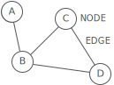
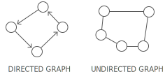
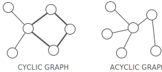
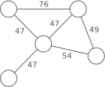
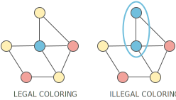

# Graph

## Summary :book:
A graph organizes items in an interconnected network. 
> Each item is a node (or vertex). Nodes are connected by edges

## Uses :scroll:
- Dijkstra's Algorithm: Find the shortest path from one node to all other nodes in a weighted graph
- Topological Sort: Arranges the nodes in a directed, acyclic graph in a special order based on incoming edges
- Minimum Spanning Tree: Finds the cheapest set of edges needed to reach all nodes in a weighted graph

## Strengths :white_check_mark:
- Representing links
> Graphs are ideal for cases where you're working with things that connect to other things. Nodes and edges could, for example, respectively represent cities and highways, routers and ethernet cables, or Facebook users and their friendships. 

## Weaknesses :x:
- Scaling challenges
> Most graph algorithms are O(n∗lg(n)) or even slower. Depending on the size of your graph, running algorithms across your nodes may not be feasible. 

# Terminology
## Directed or Undirected
In directed graphs, edges point from the node at one end to the node at the other end.
> In undirected graphs, the edges simply connect the nodes at each end. 

## Cyclic or Acyclic
A graph is cyclic if it has a cycle—an unbroken series of nodes with no repeating nodes or edges that connects back to itself.
> Graphs without cycles are acyclic. 

## Weighted or Unweighted 
If a graph is weighted, each edge has a "weight." 
> The weight could, for example, represent the distance between two locations, or the cost or time it takes to travel between the locations. 

## Legal Coloring 
A graph coloring is when you assign colors to each node in a graph.
> A legal coloring means no adjacent nodes have the same color: 

# Representations
There are a few different ways to store graphs. Let's take this graph as an example: 

## Edge list 
A list of all the edges in the graph: 
> graph = [[0, 1], [1, 2], [1, 3], [2, 3]]

Since node 3 has edges to nodes 1 and 2, [1, 3] and [2, 3] are in the edge list. 
> Sometimes it's helpful to pair our edge list with a list of all the nodes. For example, what if a node doesn't have any edges connected to it? It wouldn't show up in our edge list at all! 

## Adjacency list 
A list where the index represents the node and the value at that index is a list of the node's neighbors: 
> graph = [
    [1],
    [0, 2, 3],
    [1, 3],
    [1, 2],
]

Since node 3 has edges to nodes 1 and 2, graph[3] has the adjacency list [1, 2]. 

We could also use a dictionary where the keys represent the node and the values are the lists of neighbors. 
> graph = {
    0: [1],
    1: [0, 2, 3],
    2: [1, 3],
    3: [1, 2],
}

This would be useful if the nodes were represented by strings, objects, or otherwise didn't map cleanly to list indices. 

## Adjacency Matrix 
A matrix of 0s and 1s indicating whether node x connects to node y (0 means no, 1 means yes). 
> graph = [
    [0, 1, 0, 0],
    [1, 0, 1, 1],
    [0, 1, 0, 1],
    [0, 1, 1, 0],
]

Since node 3 has edges to nodes 1 and 2, graph[3][1] and graph[3][2] have value 1. 

# BFS and DFS 
You should know breadth-first search (BFS) and depth-first search (DFS) down pat so you can code them up quickly. 
> Lots of graph problems can be solved using just these traversals: 

Is there a path between two nodes in this undirected graph?
> Run DFS or BFS from one node and see if you reach the other one. 

What's the shortest path between two nodes in this undirected, unweighted graph?
> Run BFS from one node and backtrack once you reach the second. Note: BFS always finds the shortest path, assuming the graph is undirected and unweighted. DFS does not always find the shortest path. 

Can this undirected graph be colored with two colors?
> Run BFS, assigning colors as nodes are visited. Abort if we ever try to assign a node a color different from the one it was assigned earlier.

Does this undirected graph have a cycle?
> Run BFS, keeping track of the number of times we're visiting each node. If we ever visit a node twice, then we have a cycle. 

# Advanced graph algorithms 
Dijkstra's Algorithm:
> Finds the shortest path from one node to all other nodes in a weighted graph. 

Topological Sort:
> Arranges the nodes in a directed, acyclic graph in a special order based on incoming edges. 

Minimum Spanning Tree:
> Finds the cheapest set of edges needed to reach all nodes in a weighted graph. 
