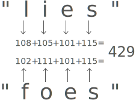
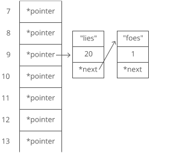

# Hash Table

## Summary :book:
A hash table organizes data so you can quickly look up values for a given key. 

## Strengths :white_check_mark:
- Fast lookups
> Lookups take O(1) time on average. 
- Flexible Keys
> Most data types can be used for keys, as long as they're hashable. 

## Weaknesses :x:
- Slow worst-case lookups
> Lookups take O(n) time in the worst case. 
- Unordered
> Keys aren't stored in a special order. 
> If you're looking for the smallest key, the largest key, or all the keys in a range, you'll need to look through every key to find it.
- Single-directional lookups
> While you can look up the value for a given key in O(1) time, looking up the keys for a given value requires looping through the whole dataset — O(n) time.
- Not cache-friendly
>  Many hash table implementations use linked lists, which don't put data next to each other in memory. 

## Time Complexity :hourglass:
| Operation  | Average Case | Worst Case |
| ---------- | ------------ | ---------- |
| space      |    O(n)      |    O(n)    |
| insert     |    O(1)      |    O(n)    |
| lookup     |    O(1)      |    O(n)    |
| delete     |    O(1)      |    O(n)    |

## Hash Maps are built on arrays
Arrays are pretty similar to hash maps already. Arrays let you quickly look up the value for a given "key" 
> . . . except the keys are called "indices," and we don't get to pick them—they're always sequential integers (0, 1, 2, 3, etc). 

Think of a hash map as a "hack" on top of an array to let us use flexible keys instead of being stuck with sequential integer "indices." 
> All we need is a function to convert a key into an array index (an integer). That function is called a hashing function. 

To look up the value for a given key, we just run the key through our hashing function to get the index to go to in our underlying array to grab the value. 
> How does that hashing function work? There are a few different approaches, and they can get pretty complicated. But here's a simple proof of concept: 

Grab the number value for each character and add those up. 

The result is 429. But what if we only have 30 slots in our array? We'll use a common trick for forcing a number into a specific range: the modulus operator (%).
> Modding our sum by 30 ensures we get a whole number that's less than 30 (and at least 0): 

429 % 30 = 9
> The hashing functions used in modern systems get pretty complicated—the one we used here is a simplified example. 

## Hash Collisions
What if two keys hash to the same index in our array? In our example above, look at "lies" and "foes"

They both sum up to 429! So of course they'll have the same answer when we mod by 30: 
> 429 % 30 = 9

This is called a hash collision. There are a few different strategies for dealing with them. 
> Here's a common one: instead of storing the actual values in our array, let's have each array slot hold a pointer to a linked list holding the values for all the keys that hash to that index: 

Notice that we included the keys as well as the values in each linked list node. Otherwise we wouldn't know which key was for which value! 
> There are other ways to deal with hash collisions. This is just one of them. 

## When Hash Table operations cost O(n) time
### Hash Collisions
If all our keys caused hash collisions, we'd be at risk of having to walk through all of our values for a single lookup (in the example above, we'd have one big linked list).
> This is unlikely, but it could happen. That's the worst case. 

### Dynamic Array Resizing
Suppose we keep adding more items to our hash map. As the number of keys and values in our hash map exceeds the number of indices in the underlying array, hash collisions become inevitable. 
> To mitigate this, we could expand our underlying array whenever things start to get crowded. That requires allocating a larger array and rehashing all of our existing keys to figure out their new position — O(n) time. 

## Sets
A set is like a hash map except it only stores keys, without values. 

Sets often come up when we're tracking groups of items—nodes we've visited in a graph, characters we've seen in a string, or colors used by neighboring nodes.
> Usually, we're interested in whether something is in a set or not. 

Sets are usually implemented very similarly to hash maps—using hashing to index into an array—but they don't have to worry about storing values alongside keys. 

