# Heap

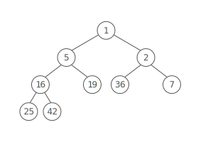

## Summary :book:
A binary heap is a binary tree where the smallest value is always at the top. 

> A min-heap has the smallest value at the top. A max-heap has the largest value at the top. We'll describe min-heaps here, but the implementation for max-heaps is nearly identical. 

## Strengths :white_check_mark:
- Quickly access the smallest item
> Binary heaps allow you to grab the smallest item (the root) in O(1) time, while keeping other operations relatively cheap (O(lg(n)) time). 
- Space efficient
> Binary heaps are usually implemented with lists, saving the overhead cost of storing pointers to child nodes. 

## Weaknesses :x:
- Limited interface
> Binary heaps only provide easy access to the smallest item. Finding other items in the heap takes O(n) time, since we have to iterate through all the nodes. 

## Time Complexity :hourglass:
| Operation  | Worst Case  |
| ---------- | ----------- |
|  get min   |    O(1)     |
| remove min |    O(lg(n)) |
|  insert    |    O(lg(n)) |
|  heapify   |    O(n)     |
|  space     |    O(n)     |

# Implementation 
Heaps are implemented as complete binary trees. 

In a complete binary tree: 
> each level is filled up before another level is added, and 

> the bottom tier is filled in from left to right. 

As we'll see, this allows us to efficiently store our heap as a list. 
> In a heap, every node is smaller than its children. 

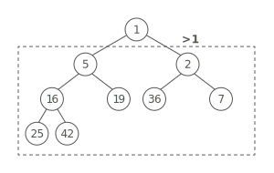
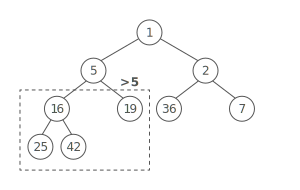
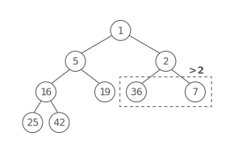
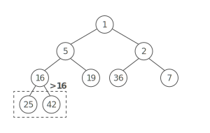

# Inserting a new item 

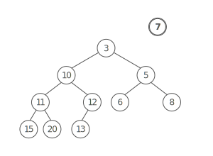

1.) Add the item to the bottom of the tree. 

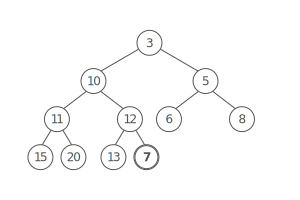

2.) Compare the item with its parent. If the new item is smaller, swap the two. 

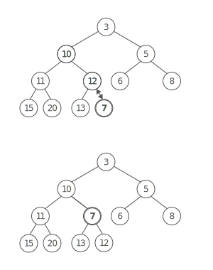

3.) Continue comparing and swapping, allowing the new item to "bubble up" until the it's larger than its parent. 

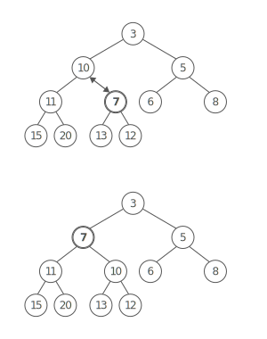

Because our heap is built on a complete binary tree, we know it's also balanced. Which means the height of the tree is lg⁡n. So we'll do at most lg⁡n of these swaps, giving us a total time cost of O(lg⁡n). 

# Removing the smallest item 
Easy—it's right there at the top: 

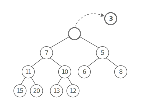

Now, we have to shuffle some things around to make this a valid heap again. 

1.) Take the bottom level's right-most item and move it to the top, to fill in the hole. 

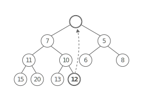

2.) Compare the item with its children. 

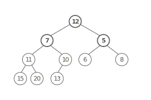

If it's larger than either child, swap the item with the smaller of the two children. 

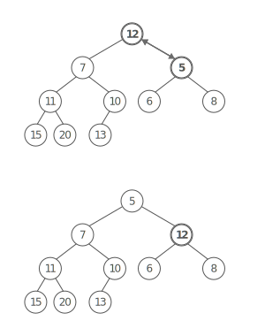

3.) Continue comparing and swapping, allowing the item to "bubble down" until it's smaller than its children. 

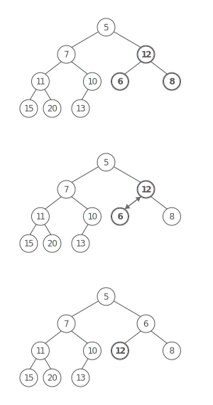

As with inserting (above), we'll do at most lg⁡n of these swaps, giving us a total time cost of O(lg⁡n). 

## Heaps are built on lists 
Complete trees and heaps are often stored as lists, one node after the other, like this: 

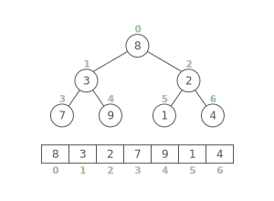

Using a list to store a complete binary tree is very efficient. Since there are no gaps in complete trees, there are no unused slots in the list. And, inserting a new item in the bottom right part of the tree just means appending to the list. 

But how do we traverse the tree when it's a list?
> How do we go from a node to its left and right children? With a bit of clever indexing! See if you can come up with the formulas for a node's left child, right child, and parent

## Heapify: Transform a List Into a Heap 
Say we want to make a heap out of the items in a list. 
> We could create a new empty heap and add in the items from the list one at a time. If the list has nnn elements, then this takes O(n∗lg⁡(n)). 

It turns out that there's a more efficient way to transform a list into a heap. 
> We'll take our input list and treat it like the nodes in a complete binary tree, just like we did above: 

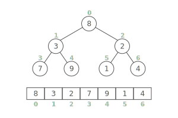

To transform the tree into a valid heap, we'll compare each node to its children and move nodes around so that parent nodes are always smaller than their children. 

This causes larger nodes to move lower in the tree, "bubbling down" to allow smaller values to reach the top. 
> Look familiar? This is the same bubbling down we were doing to remove items from the heap! 

We'll work from the leaf-nodes at the bottom upwards. To start off, let's look at the leaves. 

The leaf nodes don't have any children, so they don't need to move down at all. Great. 

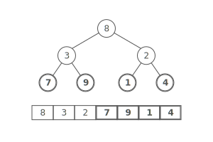

Let's look at the nodes in the next level: 

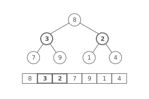

We'll start with the left node (3) and its children: 

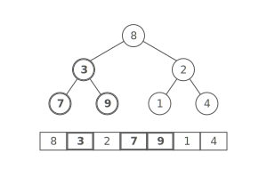

Since 3 is smaller than both 7 and 9, it's already in the right spot. 

But, looking at the right node (2) and its children, since 1 is smaller than 2, we'll swap them. 

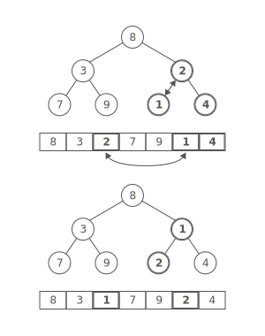

Notice how we've got two small valid min-heaps. We're getting close! 

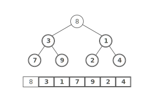

Moving up, we've got an 8 at the root.

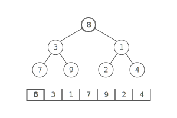

Since 8 is larger than 1, 8 bubbles down, swapping places with the smaller child: 1. 

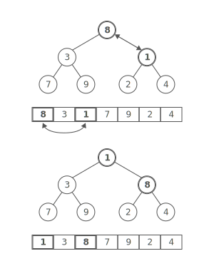

Then, we need to compare 8 to its two children—2 and 4. Since 8 is bigger than both of them, we swap with the smaller child, which is 2. 

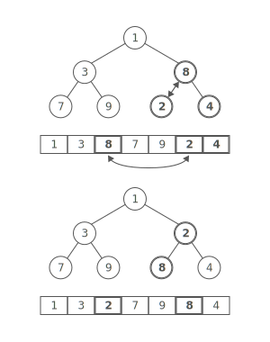

At this point, we've transformed the input tree into a valid min heap. Nice! 

# Heapify complexity 
What's the time complexity of heapify'ing a list? 
> It's tempting to say it's O(n∗lg⁡(n)). After all, we have to examine all nnn nodes, and a node might bubble down O(lg⁡(n)) levels. 

That's an overestimate of the amount of work though. All of the leaf nodes at the bottom of the tree won't have to move down at all. And the parents of those nodes will only move down once. In fact, there's only one node that might move down O(lg⁡(n)) times: the root node. 

Since binary heaps are based on complete binary trees, there will be n/2 nodes in the bottom level, n/4 nodes in the second-to-last level, etc. Each time we go up a level we cut the number of nodes in half. 

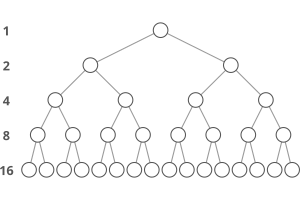

So, we'll move n/2 nodes on the bottom level 0 times. The n/4 nodes one level up move at most 1 time. Then, n/8 nodes move at most 2 times. And so on, until we get to the root node, which moves lg⁡(n) times. 

Adding this all up, we've got: 
> 0 * (n/2) + 1 * (n/4) + 2 * (n/8) + 3 * (n/16) + ...

Alternatively, this can be expressed as a summation: 
> n * ∑ * (i / (2^i + 1) )

The sum is a geometric series that converges to 1/2. (Take our word for it—the arithmetic to prove this gets a bit hairy.) Then, multiplying by n, we have n/2. That's O(n). 

