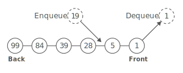
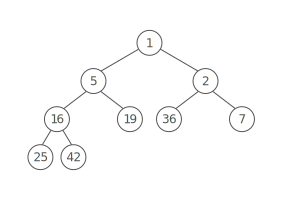

# Priority Queue

## Summary :book:
A priority queue is a special queue where: 
> Every item in the queue has a priority, and 

> Higher-priority items are dequeued before lower-priority items.

Picture a big list of bugs for an engineering team to tackle. You want to keep the highest-priority bugs at the top of the list. 

## Uses :scroll:
- Any time you want to handle things with different priority levels: triaging patients in a hospital, locating the closest available taxi, or just a to-do list. 
- Certain foundational algorithms rely on priority queues:
> Dijkstra's shortest-path, A* search (a graph traversal algorithm like BFS), and Huffman codes (an encoding for data compression) 

## Strengths :white_check_mark:
- Quickly access the highest-priority item
> Priority queues allow you to peek at the top item in O(1) while keeping other operations relatively cheap (O(lg(n)). 

## Weaknesses :x:
- Slow enqueues and dequeues
> Both operations take O(lg⁡(n)) time with priority queues. With normal first-in, first-out queues, these operations are O(1) time. 

## Time Complexity :hourglass:
| Operation  | Worst Case |
| ---------- | ---------- |
| space      |    O(n)     |
| peek       |    O(1)     |
| dequeue    |    O(lg(n)) |
| enqueue    |    O(lg(n)) |

# Implementation 
## Binary Heaps 
Priority queues are often implemented using binary heaps. Notice how the highest priority is right at the top of the heap, ready to be grabbed in O(1) time. 

- To enqueue an item, add it to the heap using the priority as the key. (O(lg⁡(n)) time) 
- To peek at the highest priority item, look at the item at the top. (O(1) time) 
- To dequeue the highest priority item, remove the top item from the heap. (O(lg⁡(n)) time) 

## Other Options 
A Sorted List
> To enqueue, use binary search to figure out where the new item should go. Then scoot items over to make space for the new item. (O(n) time, since in the worst case you have to scoot everything over to make room) 

> To peek at the highest priority item, look at the item at index zero. (O(1) time) 

> To dequeue, scoot every item forward one index. (O(n) time) 

A Sorted Linked List 
> To enqueue, walk through the linked list to figure out where the new item should go. Then, reassign pointers to add the new item. (O(n) time) 

> To peek at the highest priority item, look at the item at the head of the linked list. (O(1) time) 

> To dequeue, update the linked list's head pointer to point to the second item. (And deallocate the old head node, if you're using a language with manual memory management.) (O(1) time) 

## Fancier Heaps 
Binary heaps are just one kind of heap. Other kinds of heaps (e.g.: Fibonacci heaps or binomial heaps) can offer faster average performance for some priority queue operations. But, they're much more complex than binary heaps and less commonly used in practice. 
