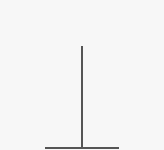

# Stack

## Summary :book:
A stack stores items in a last-in, first-out (LIFO) order. 
> Picture a pile of dirty plates in your sink. 
> As you add more plates, you bury the old ones further down. 
> When you take a plate off the top to wash it, you're taking the last plate you put in. 

"Last in, first out." 

## Strengths :white_check_mark:
- Fast Operations
> All stack operations take O(1) time. 

## Weaknesses :x:
- VERY costly to search
> Don't use a stack if you need to operate on middle elements consistently

## Time Complexity :hourglass:
| Operation  | Worst Case |
| ---------- | ---------- |
| space      |    O(n)    |
| push       |    O(1)    |
| pop        |    O(1)    |
| peek       |    O(1)    |
