# Tree

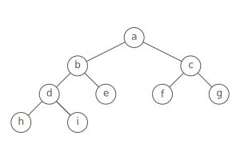

## Summary :book:
A tree organizes values hierarchically. 
> Each entry in the tree is called a node, and every node links to zero or more child nodes. 

## Leaves, Depth, and Height 
Leaf nodes are nodes that're on the bottom of the tree (more formally: nodes that have no children). 
> Each node in a tree has a depth: the number of links from the root to the node. 

> A tree's height is the number of links from its root to the furthest leaf. (That's the same as the maximum node depth.) 

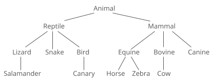

# Tree Traversals 

## Breadth First Search (BFS) 
In a BFS, you first explore all the nodes one step away, then all the nodes two steps away, etc.. 
> Breadth-first search is like throwing a stone in the center of a pond. The nodes you explore "ripple out" from the starting point. 

Here's a sample tree, with the nodes labeled in the order they'd be visited in a BFS. 

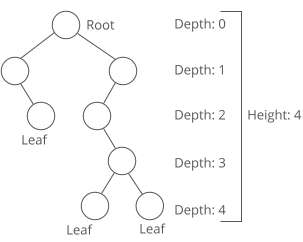

## Depth First Search (DFS) 
In a DFS, you go as deep as possible down one path before backing up and trying a different one. 
> Depth-first search is like walking through a corn maze. You explore one path, hit a dead end, and go back and try a different one. 

Here's a how a DFS would traverse the same example tree: 

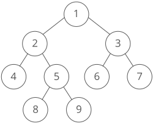

### Comparing BFS and DFS
> A BFS will find the shortest path between the starting point and any other reachable node. A depth-first search will not necessarily find the shortest path. 

> Depth-first search on a binary tree generally requires less memory than breadth-first. 

> Depth-first search can be easily implemented with recursion. 

## Pre Order Traversal 
Visit the current node, then walk the left subtree, and finally walk the right subtree. 
> A pre-order traversal usually visits nodes in the same order as a DFS. 

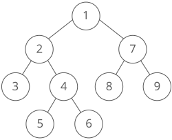

## In Order Traversal 
 Walk the left subtree first, then visit the current node, and finally walk the right subtree. 
 > Of all three traversal methods, this one is probably the most common. When walking a binary search tree, an in order traversal visits the nodes in sorted, ascending order. 
 

## Post Order Traversal 
Walk the left subtree, then the right subtree, and finally visit the current node. 
> This one's kind of rare ... but it shows up in some parsing algorithms, like Reverse Polish Notation. 

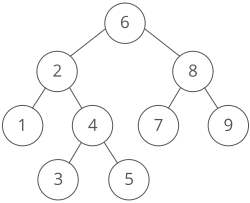

# Binary Trees
A binary tree is a tree where every node has at most two children. 

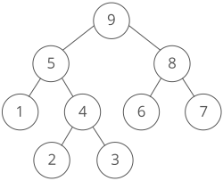

## Full Binary Trees
A full binary tree is a binary tree where every node has exactly 0 or 2 children. 

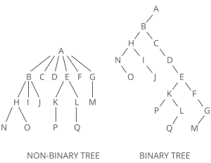

## Perfect Binary Trees 
A perfect binary tree doesn't have room for any more nodes—unless we increase the tree's height. 

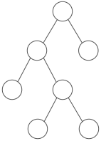

## Complete Binary Trees 
A complete binary tree is like a perfect binary tree missing a few nodes in the last level. Nodes are filled in from left to right. 
> Complete trees are the basis for heaps and priority queues. 

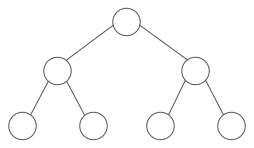

## Balanced Binary Trees 
A balanced binary tree is a tree whose height is small relative to the number of nodes it has. By small, we usually mean the height is O(lg(n)), where n is the number of nodes. 

Conceptually, a balanced tree "looks full," without any missing chunks or branches that end much earlier than other branches. 
> There are few different definitions of balanced depending on the context. One of the most common definition is that a tree is balanced if: (a) the heights of its left and right subtrees differ by at most 1, and (b) both subtrees are also balanced. 

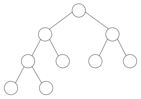

> Similar definitions can be used for trees that have more than two children. For instance, a full ternary tree (with up to three children per node) is a tree where every node has zero or three children. 

# Relationship between height and number of nodes 
In perfect binary trees there's a cool mathematical relationship between the number of nodes and the height of the tree. 

First, there's a pattern to how many nodes are on each level: 

| Level  | Formula | Number of Nodes |
| ------ | ------- | --------------- |
|   0    |   2^0   |     1 nodes     |
|   1    |   2^1   |     2 nodes     |
|   2    |   2^2   |     4 nodes     |
|   3    |   2^3   |     8 nodes     |

Let's call the total number of nodes in the tree n, and the height of the tree h. 

We could solve for n by adding up the number of nodes on each level in the tree: 
> n = 2^0 + 2^1 + 2^2 + 2^3 + ... + 2^(h−1) = 2^(h) − 1

Solving for h in terms of n, we get: 
> n = 2^(h) − 1

> n + 1 = 2^h

> log2(n+1) = log2(2^h)

> log2(n+1) = h

That's the relationship between a perfect binary tree's height and the number of nodes it has. 
> This is the intuition behind our definition of balanced that we used above. A perfect tree is balanced, and in a perfect tree the height grows logarithmically with the number of nodes. 
