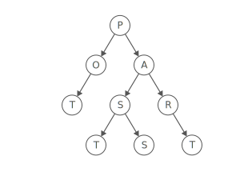
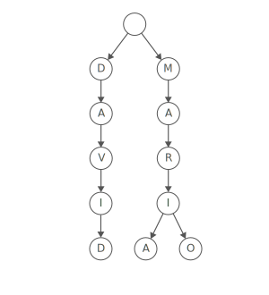
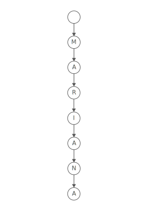
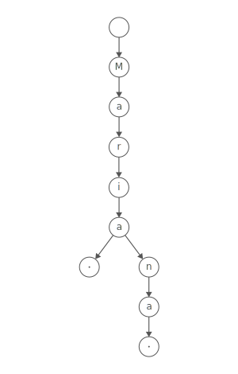
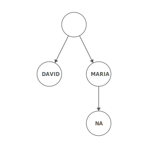

# Trie

## Summary :book:
A trie is a special tree that can compactly store strings. 
> Here's a trie that stores "David", "Maria", and "Mario": 

Notice that we only store "Mari" once, even though it appears in two strings: "Maria" and "Mario". 

## Uses :scroll:
- Easily print all words in alphabetical order
- Efficiently prefix search (auto complete)
- 

## Strengths :white_check_mark:
- Sometimes Space-Efficient
> If you're storing lots of words that start with similar patterns, tries may reduce the overall storage cost by storing shared prefixes once. 
- Efficient Prefix Queries
> Tries can quickly answer queries about words with shared prefixes, like: 

> How many words start with "choco"? 
> What's the most likely next letter in a word that starts with "strawber"? 

## Weaknesses :x:
- Usually Space-Inefficient
> Tries rarely save space when compared to storing strings in a set. 

> ASCII characters in a string are one byte each. Each link between trie nodes is a pointer to an address—eight bytes on a 64-bit system. So, the overhead of linking nodes together often outweighs the savings from storing fewer characters. 

- Not Standard
> Most languages don't come with a built-in trie implementation. You'll need to implement one yourself. 

## Time Complexity :hourglass:
| Operation  |   Worst Case   |
| ---------- | -------------- |
| space      |    O(n * k)    |
| insert     |      O(k)      |
| lookup     |      O(k)      |

## Marking word endings 
What happens if we have two words and one is a prefix of the other? 
> For instance, say we had a trie with "Maria" and "Mariana". Here's what that trie would look like. 

That's confusing ... it looks like we only have one word ("Mariana") even though we inserted two. 
> To avoid this, most tries append a special character to every word as a "flag" for the end of the word. 

Let's use "." as our "end of word" marker. Here's what our trie looks like now. 

Now we can see that "Maria" is an actual item in our trie, not just a prefix for "Mariana". 

## Tries vs. Sets 
Say you were implementing a spell checker. You'll look for each word to see if it appears in Merriam-Webster's dictionary. 
> You could put all the dictionary words in a trie. Or, you could put them in a set. 

Both options have the same average-case lookup complexity: O(k)O(k)O(k), where kkk is the number of characters in the lookup string: 
> For the trie, you'd have to walk from the root of the trie through kkk nodes, one character at a time. 

> For the set, you have to compute a hash value from all kkk characters of the string in order to index into the underlying array. 

So, if they have the same complexity, which one should you use? 

Use a trie if you want to quickly find words starting with the same prefix. In our spell checker, this might be useful for suggesting corrections (i.e.: fixing "chocolatr" to "chocolate"). The only way to do this with a set would be to iterate through all the words, in O(n) time. 

Use a hash set if you just need to check if a string is present or you're optimizing for space. In most cases, a hash set will take up fewer bytes than a trie. And, hash set lookups will probably be faster than trie lookups—trie nodes can be scattered throughout memory, which isn't cache friendly. 
> Hash sets aren't cache-friendly either. But with a hash set, you usually make one non-sequential memory lookup, versus kkk of them with a trie. (Here, kkk is the number of characters in the string.) 

## Radix Trees 
A radix tree is like a trie, but it saves space by combining nodes together if they only have one child. 
> Here's what a radix tree with "Maria", "Mariana", and "David" looks like. 

Notice how it has way fewer nodes and links than the trie version we looked at above. 
> Radix trees are more cache friendly than tries, since the characters within a single node are usually stored in an array of characters, adjacent to each other in memory. 

> Curious about other variations on tries? Check out ternary search trees, HAT-tries, and burst tries for lots more optimizations. 
